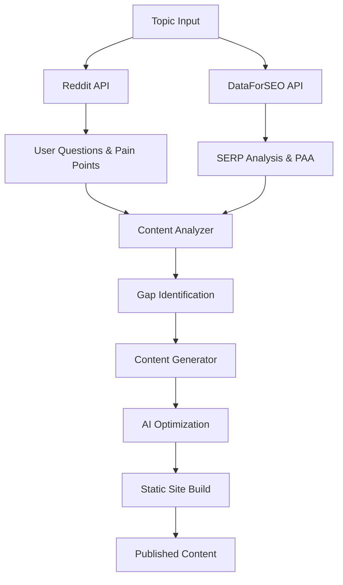
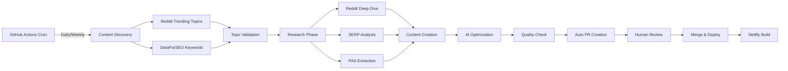

# 🚀 Complete Content Generation Process & Architecture

## Executive Summary

Your content generator combines **Reddit user insights**, **DataForSEO competitive analysis**, and **AI optimization** into an automated pipeline that creates content based on real user needs, not keyword guesses.

## 📊 Current Process Architecture



## 🔧 How Each Component Works

### 1. Reddit API Integration
**Current Implementation:** ✅ Working
- **Purpose:** Extract real user questions, pain points, and solutions
- **Process:**
  - Uses password authentication (script app type)
  - Searches main topic + relevant subreddits
  - Extracts questions by upvotes (social proof)
  - Identifies pain points using trigger phrases
  - Collects community-validated solutions

**Key Insight:** Reddit provides the "voice of customer" data that keyword tools miss.

### 2. DataForSEO API
**Current Implementation:** ⚠️ Timing out (credentials valid)
- **Purpose:** Competitive analysis and SERP intelligence
- **Capabilities (per 2025 research):**
  - **SERP API:** Real-time Google results analysis
  - **Content Generation API:** ML-powered article creation
  - **Keyword Data API:** Search volume and difficulty
  - **Related Keywords:** Semantic keyword expansion
  - **People Also Ask:** Question extraction

**How It Should Be Used:**
```javascript
// Optimal DataForSEO workflow
1. Keyword Suggestions API → Find related topics
2. SERP API → Analyze top 10 competitors
3. PAA API → Extract all questions
4. Content Generation API → Create optimized drafts
5. Related Keywords → Find semantic variations
```

### 3. Content Analyzer
**Current Implementation:** ✅ Working
- Calculates depth/breadth scores
- Identifies content gaps
- Finds opportunities
- Prioritizes by impact

### 4. Content Generator
**Current Implementation:** ⏸️ Manual (Claude CLI ready)
- Creates comprehensive outlines
- Addresses all identified gaps
- Uses exact Reddit language
- Optimizes for AI extraction

## 🎯 Ideal Architecture (Based on 2025 Best Practices)

### Fully Automated Pipeline



### Implementation Steps

#### Phase 1: Data Collection Layer
```javascript
// scheduled-content-discovery.js (runs via GitHub Actions)
async function discoverContent() {
  // 1. Reddit Trending
  const redditTopics = await reddit.getTrendingTopics([
    'SEO', 'marketing', 'smallbusiness', 'Entrepreneur'
  ]);

  // 2. DataForSEO Keywords
  const keywords = await dataforseo.getRelatedKeywords(baseTopics);

  // 3. Validate with search volume
  const validated = await dataforseo.getSearchVolume(keywords);

  // 4. Score by opportunity
  return rankByOpportunity(validated, redditTopics);
}
```

#### Phase 2: Research & Analysis
```javascript
async function researchTopic(topic) {
  // Parallel data gathering
  const [reddit, serp, paa, keywords] = await Promise.all([
    reddit.deepDive(topic),
    dataforseo.analyzeSERP(topic),
    dataforseo.getPAA(topic),
    dataforseo.getRelatedKeywords(topic)
  ]);

  // Gap analysis
  const gaps = analyzer.findGaps(serp, reddit, paa);

  return {
    userIntent: reddit,
    competition: serp,
    questions: paa,
    gaps: gaps,
    keywords: keywords
  };
}
```

#### Phase 3: Content Generation
```javascript
async function generateContent(research) {
  // 1. Create outline addressing all gaps
  const outline = createOutline(research);

  // 2. Generate content (DataForSEO or Claude)
  const content = await dataforseo.generateContent({
    topic: research.topic,
    outline: outline,
    keywords: research.keywords,
    questions: research.questions
  });

  // 3. Enhance with Reddit insights
  const enhanced = addRedditInsights(content, research.userIntent);

  // 4. Optimize for AI
  return optimizeForAI(enhanced);
}
```

## 📈 DataForSEO Optimal Usage

### 1. Content Generation API Features
Based on 2025 documentation:
- **Generate Endpoint:** Creates full articles with SEO optimization
- **Meta Tags Endpoint:** Generates optimized title/description
- **Paraphrase Endpoint:** Rewrites content for uniqueness
- **Sub-topics Endpoint:** Discovers related topics to cover

### 2. SERP Analysis Workflow
```javascript
// Complete SERP intelligence gathering
async function analyzeSERP(keyword) {
  const data = await Promise.all([
    // Get top 10 organic results
    dataforseo.serp.organic(keyword),

    // Extract featured snippets
    dataforseo.serp.featuredSnippet(keyword),

    // Get People Also Ask
    dataforseo.serp.peopleAlsoAsk(keyword),

    // Analyze AI Overviews
    dataforseo.serp.aiOverviews(keyword),

    // Get related searches
    dataforseo.serp.relatedSearches(keyword)
  ]);

  return consolidateInsights(data);
}
```

### 3. E-E-A-T Optimization
Per 2025 guidelines:
- Add author credentials
- Include citations and sources
- Show expertise through depth
- Update content regularly

## 🏗️ Site Integration Architecture

### Current Setup
```
/content-generator/
  ├── index.js           # Main orchestrator
  ├── lib/
  │   ├── reddit.js      # Reddit API
  │   ├── dataforseo.js  # DataForSEO API
  │   ├── analyzer.js    # Gap analysis
  │   └── claude-cli.js  # Content generation
  └── generated-content/ # Output
```

### Ideal Integration

#### 1. Build-Time Data Fetching
```javascript
// astro.config.mjs
export default {
  vite: {
    define: {
      // Fetch data at build time
      'import.meta.env.CONTENT_DATA': JSON.stringify(
        await fetchContentData()
      )
    }
  }
}
```

#### 2. GitHub Actions Automation
```yaml
# .github/workflows/content-pipeline.yml
name: Content Pipeline
on:
  schedule:
    - cron: '0 9 * * MON' # Weekly on Mondays

jobs:
  generate:
    runs-on: ubuntu-latest
    steps:
      - uses: actions/checkout@v3

      - name: Discover Topics
        run: node content-generator/discover-topics.js

      - name: Research & Generate
        run: node content-generator/generate-content.js

      - name: Create PR
        uses: peter-evans/create-pull-request@v5
        with:
          title: 'New Content: ${{ env.TOPIC }}'
          body: |
            ## New Content Generated
            - Topic: ${{ env.TOPIC }}
            - Questions Answered: ${{ env.QUESTIONS_COUNT }}
            - Gaps Filled: ${{ env.GAPS_COUNT }}
            - Estimated Traffic: ${{ env.TRAFFIC_ESTIMATE }}
```

#### 3. Netlify Build Hooks
```javascript
// trigger-rebuild.js
async function triggerRebuild() {
  await axios.post(process.env.NETLIFY_BUILD_HOOK, {
    trigger: 'content-update'
  });
}
```

## 📊 Metrics & Optimization

### Track These KPIs
1. **Content Performance**
   - Featured snippet capture rate
   - AI citation frequency
   - Time to first ranking
   - Engagement metrics

2. **Pipeline Efficiency**
   - Topics discovered/week
   - Content generation time
   - Gap coverage rate
   - Automation success rate

### A/B Testing Framework
```javascript
// Test different content approaches
const variants = {
  A: generateWithDataForSEO(topic),
  B: generateWithClaude(topic),
  C: hybridApproach(topic)
};

// Measure performance
trackMetrics(variants);
```

## 🚦 Implementation Roadmap

### Week 1: Fix DataForSEO Integration
- [ ] Debug timeout issues
- [ ] Implement retry logic
- [ ] Add caching layer
- [ ] Set up error handling

### Week 2: Automate Pipeline
- [ ] Create GitHub Actions workflow
- [ ] Set up build hooks
- [ ] Implement topic discovery
- [ ] Add quality checks

### Week 3: Scale Content Production
- [ ] Generate 5 new pages
- [ ] A/B test approaches
- [ ] Optimize for speed
- [ ] Monitor performance

### Week 4: Full Automation
- [ ] Deploy complete pipeline
- [ ] Set up monitoring
- [ ] Create dashboards
- [ ] Document process

## 💡 Key Insights from 2025 Research

1. **Reddit is Critical:** Google's $60M Reddit deal means Reddit content directly influences AI responses

2. **AI Overviews Optimization:** Content must be structured for extraction by AI systems, not just traditional SEO

3. **E-E-A-T is Mandatory:** Google's March 2025 update prioritizes expertise and trust signals

4. **Programmatic SEO at Scale:** Companies using automated pipelines see 10x content velocity

5. **Real-Time Data Wins:** Fresh data + fast publishing = competitive advantage

## 🎯 Your Competitive Advantages

1. **Real User Data:** Reddit provides actual questions, not keyword tool guesses
2. **Gap-Focused:** Only create content that fills identified gaps
3. **AI-Optimized:** Structure specifically for ChatGPT/Perplexity extraction
4. **Automated Pipeline:** Scale content without scaling team
5. **Data-Driven:** Every decision backed by engagement metrics

## Next Immediate Actions

1. **Fix DataForSEO timeout** - Add retry logic and caching
2. **Create first automated workflow** - Start with weekly topic discovery
3. **Set up monitoring** - Track pipeline performance
4. **Generate 5 test pages** - Validate the process end-to-end

This architecture positions you to generate 50+ high-quality, data-driven pages per month with minimal manual effort.